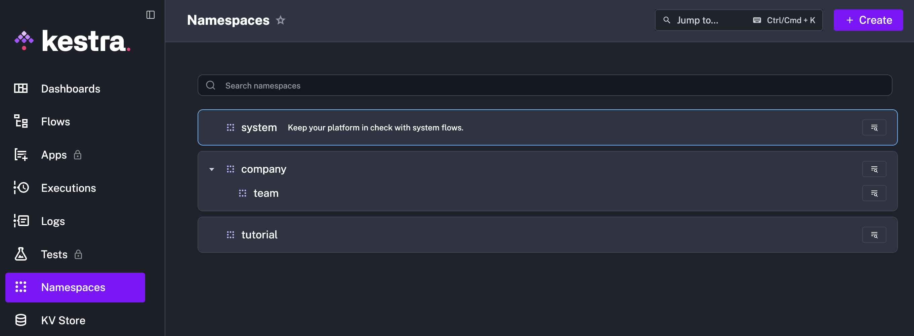
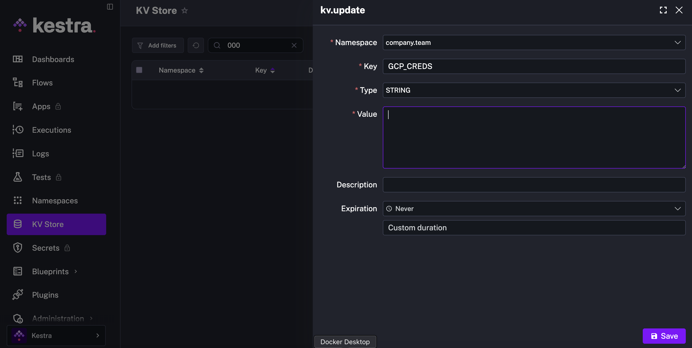
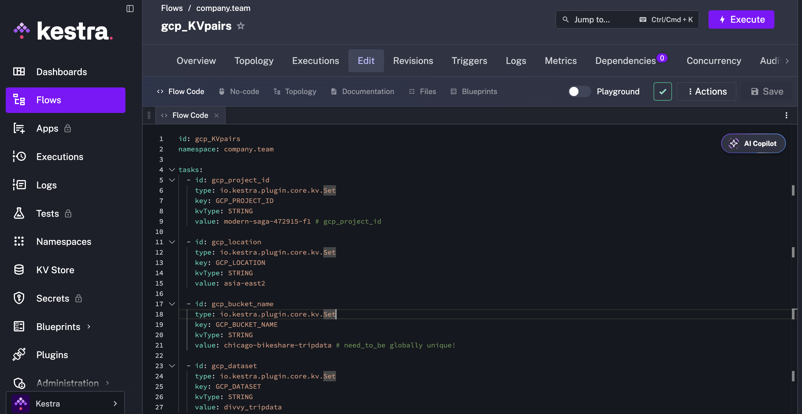
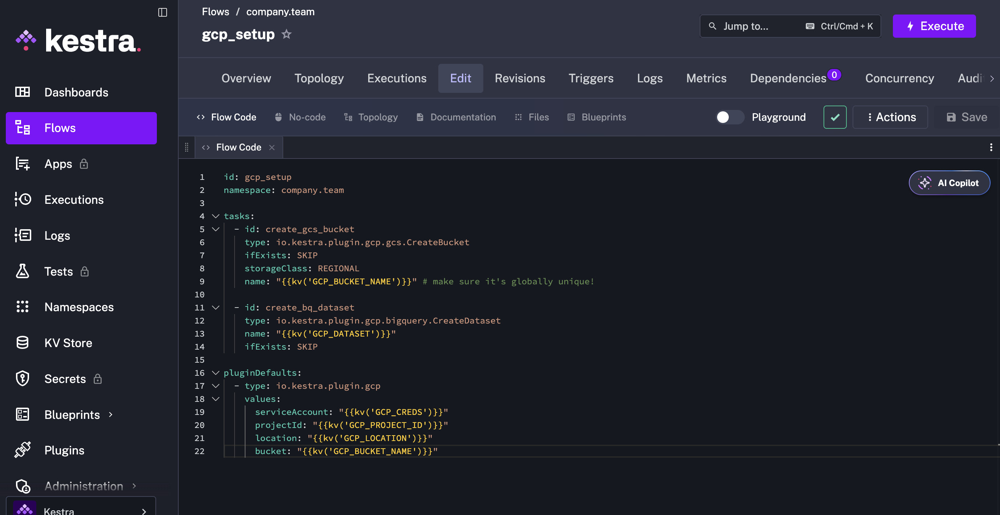
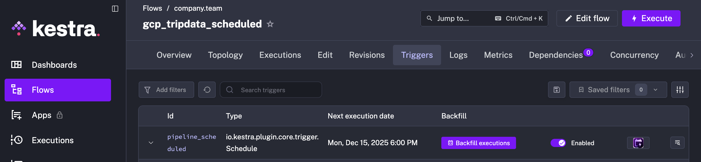
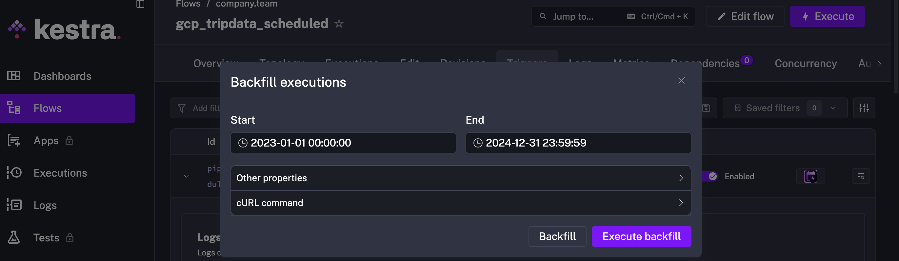

# How To Run this Project:

A guide to explain how to set up and run the Chicago Bikeshare (Divvy) data pipeline from ingestion through transformation to analytics.

## Prerequisites

- Docker and Docker Compose installed locally
- Google Cloud Platform (GCP) project with:
  - Google Cloud Storage bucket created (e.g. `chicago-bikeshare-tripdata`)
  - BigQuery dataset created (e.g. `divvy_tripdata`)
  - Service account with appropriate permissions for GCS and BigQuery, and JSON key file
- dbt Cloud account and project configured to connect to your BigQuery dataset
- Google Looker Studio (for dashboard viewing)


## 1. Set Up and Run Kestra Pipeline

### Step 1: Clone the repository

```bash
git clone <https://github.com/brisson0916/chicago_bikeshare_pipeline.git>
cd 01_workflow_orchestration
```

### Step 2: Configure environment variables

- Place your GCP service account JSON key file in a secure directory.
- Update `gcp_KVpairs.yaml` with your GCP project ID, dataset, bucket name, and location.
- Create a `.env` file under the `01_workflow_orchestration` folder to store environment variables
  ```bash
  touch .env
  ```
- In the `.env` file, setup the following Credentials for Postres and Kestra
  ```yaml
  # Postgres credentials
  POSTGRES_DB=
  POSTGRES_USER=
  POSTGRES_PASSWORD=

  # Kestra credentials
  KESTRA_DB_URL=
  KESTRA_BASIC_AUTH_USERNAME=
  KESTRA_BASIC_AUTH_PASSWORD=

  # Kestra configuration
  KESTRA_URL=http://localhost:8080/
  ```

### Step 3: Start Kestra & Postgres containers

Within the `01_workflow_orchestration` folder, use the following command to start the nessesary Kestra and Postgres services.
```bash
docker-compose up -d
```

### Step 4: Configure Secrets and Key Value Pairs in Kestra

- Access Kestra UI at `http://localhost:8080`.
- Go to the `Namespaces` tab and create a new one (eg. company.team)
  
- Go to the `KV Store` tab and select `New Key Value`. Select the namespace you created and enter `GCP_CREDS` as `Key`, `String` as `Type`, and paste the GCP Service Account JSON file contents as `Value`. Click Save.
  
- Go to Flow, and execute `gcp_KVpairs` and `gcp_setup`
  
  

### Step 5: Trigger the pipeline

- The pipeline is configured with a cron schedule to run on the 15th of each month at 9 AM automatically.
- To manually trigger a backfill for specific previous months, go to the `flows` tab, select `gcp_tripdata_scheduled`, go to the `trigger` ribbon, and press `backfill executions`.
  
- Choose the range of date that covers the months you want to execute the backfills for, and press `Execute Backfill`.
  
- Check that the raw CSV files are uploaded to GCS, and tables are loaded into BigQuery.


## 2. Run dbt Transformations

### Step 1: Set up dbt Cloud

- Connect your dbt Cloud project to your BigQuery dataset.
- Ensure your dbt profiles are correctly configured to use your GCP credentials.

### Step 2: Deploy and schedule dbt runs

- Push the dbt models from the `02_dbt_transformation/chicago_bikeshare` folder to your dbt Cloud repo.
- Create a scheduled job in dbt Cloud to run the models monthly, shortly after Kestra ingestion completes.

---

## 3. Access Analytics Dashboards

- The transformed data in BigQuery is connected to Google Looker Studio.
- Access the main dashboard here:  
  [Chicago Bikeshare Report 2023-2024](https://lookerstudio.google.com/reporting/b38cc423-b4e1-4f73-b794-7f03c64d210b)


## Troubleshooting
- Verify GCP permissions and service account credentials.
- Confirm dbt Cloud connection settings and profiles.
- Review BigQuery dataset and table permissions.