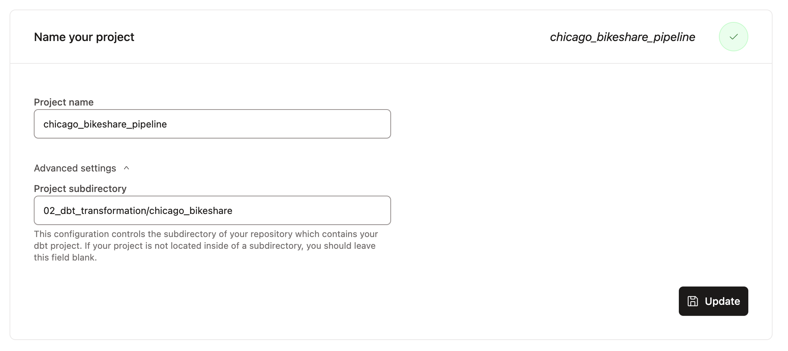
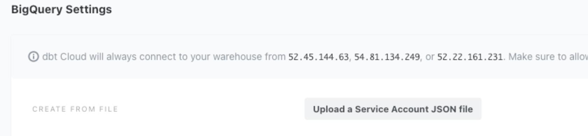
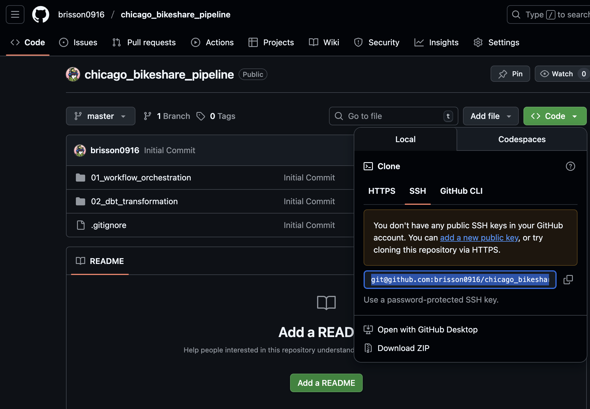
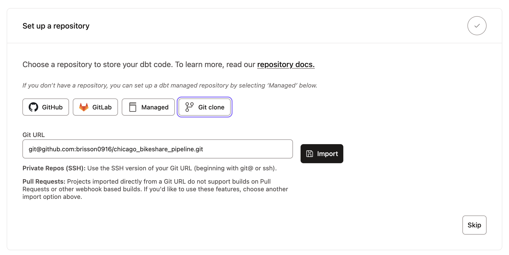
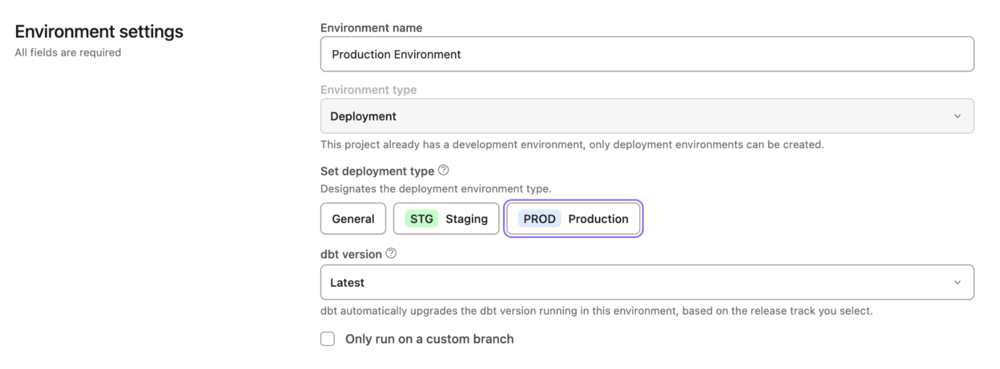
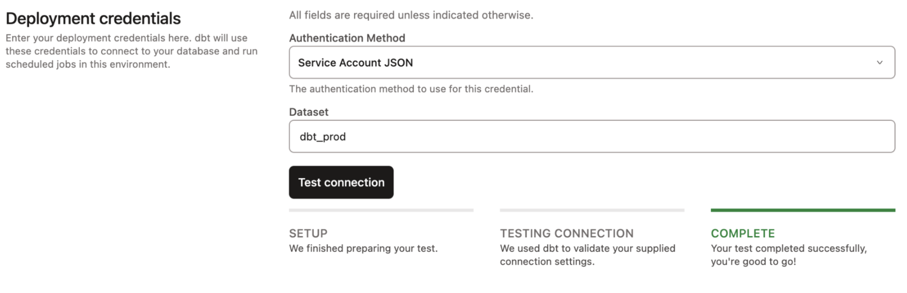
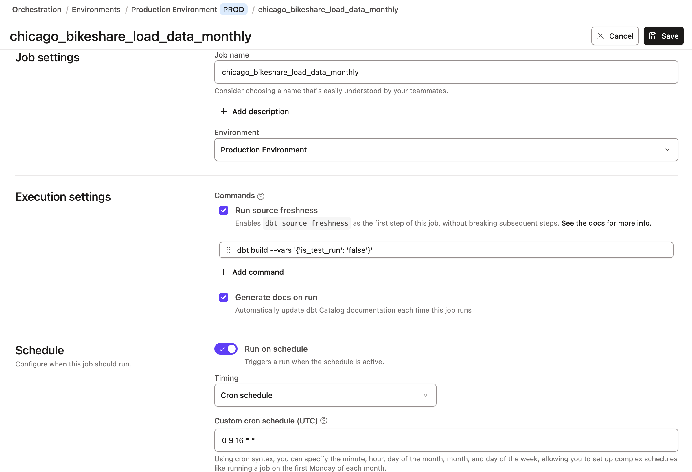
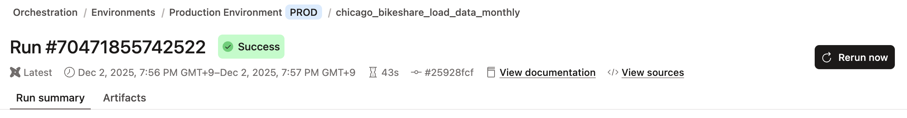
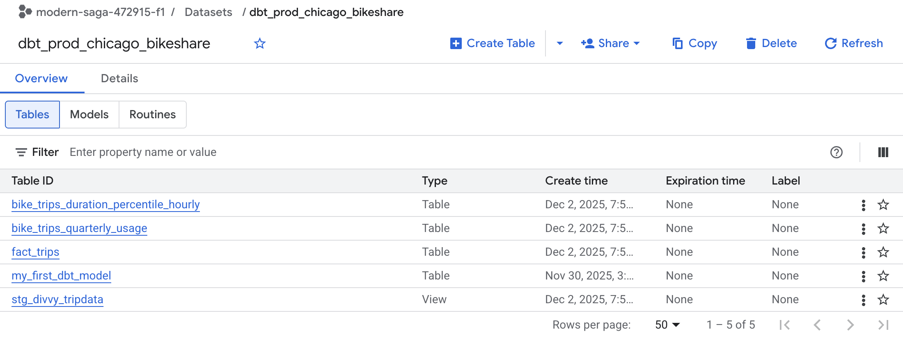
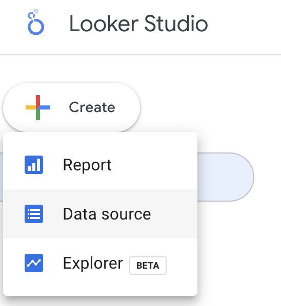

# How To Run this Project:

A guide to explain how to set up and run the Chicago Bikeshare (Divvy) data pipeline from ingestion through transformation to analytics.

## Prerequisites

- Docker and Docker Compose installed locally
- Google Cloud Platform (GCP) project with:
  - Google Cloud Storage bucket created (e.g. `chicago-bikeshare-tripdata`)
  - BigQuery dataset created (e.g. `divvy_tripdata`)
  - Service account with appropriate permissions for GCS and BigQuery, and JSON key file
- dbt Cloud account and project configured to connect to your BigQuery dataset
- Google Looker Studio (for dashboard viewing)


## 1. Set Up and Run Kestra Pipeline

### Step 1: Clone the repository

```bash
git clone <https://github.com/brisson0916/chicago_bikeshare_pipeline.git>
cd 01_workflow_orchestration
```

### Step 2: Configure environment variables

- Place your GCP service account JSON key file in a secure directory.
- Update `gcp_KVpairs.yaml` with your GCP project ID, dataset, bucket name, and location.
- Create a `.env` file under the `01_workflow_orchestration` folder to store environment variables
  ```bash
  touch .env
  ```
- In the `.env` file, setup the following Credentials for Postres and Kestra
  ```yaml
  # Postgres credentials
  POSTGRES_DB=
  POSTGRES_USER=
  POSTGRES_PASSWORD=

  # Kestra credentials
  KESTRA_DB_URL=
  KESTRA_BASIC_AUTH_USERNAME=
  KESTRA_BASIC_AUTH_PASSWORD=

  # Kestra configuration
  KESTRA_URL=http://localhost:8080/
  ```

### Step 3: Start Kestra & Postgres containers

Within the `01_workflow_orchestration` folder, use the following command to start the nessesary Kestra and Postgres services.
```bash
docker-compose up -d
```

### Step 4: Configure Secrets and Key Value Pairs in Kestra

- Access Kestra UI at `http://localhost:8080`.
- Go to the `Namespaces` tab and create a new one (eg. company.team)
  
- Go to the `KV Store` tab and select `New Key Value`. Select the namespace you created and enter `GCP_CREDS` as `Key`, `String` as `Type`, and paste the GCP Service Account JSON file contents as `Value`. Click Save.
  
- Go to Flow, and execute `gcp_KVpairs` and `gcp_setup`
  
  

### Step 5: Trigger the pipeline

- The pipeline is configured with a cron schedule to run on the 15th of each month at 9 AM automatically.
- To manually trigger a backfill for specific previous months, go to the `flows` tab, select `gcp_tripdata_scheduled`, go to the `trigger` ribbon, and press `backfill executions`.
  
- Choose the range of date that covers the months you want to execute the backfills for, and press `Execute Backfill`.
  
- Check that the raw CSV files are uploaded to GCS, and tables are loaded into BigQuery.


## 2. Run dbt Transformations

### Step 1: Connect DBT with Big Query

- Create a dbt cloud account from the [DBT official website](https://www.getdbt.com/pricing/).
- When have created an account and logged in you will be prompt to create a new project.
  - Name your project and select the sub-directory where the DBT home folder will be stored in your repository.
  
  - Choose `Bigquery` as the data warehouse.
  - Upload your Google Cloud Service Account JSON file containing your credentials to the `Create From File` option. This will fill out fields related to the production credentials. Scroll down to the bottom of the page and set up your development credentials. Click Test to Test Connection.
  

### Step 2: Connect DBT with Github

- Go to your Github repository. Select `Code`, `SSH Key`, and copy the Key.

- Back to DBT, in the add repository step, select `Git Clone`. Paste the link you just copied.


### Step 3: Deploy and schedule dbt runs
- Push the dbt models from the `02_dbt_transformation/chicago_bikeshare` folder to your dbt Cloud repo.
- Create a production environment to run run the models.
  - Under the orchestration tab on the left, go to `Environments` and select `Create New Environment`.
  - Name your new environment and select the deployment type as `production`.
  
  - Next, Select `Service Account JSON` to read the Google Cloud Credentials uploaded in Step 1.
  - Specify a new dataset in your BigQuery project to store the production models (if dataset does not exist dbt will create it in BigQuery.)
  - Press `Test Connection` and make sure it suceeds.
  
- Create a scheduled job in dbt Cloud to run the models monthly, shortly after Kestra ingestion completes.
  - Under the orchestration tab on the left, go to `Jobs` and select `Create Job`.
  - Name the job and select the environment you have created.
  - Add the `dbt build --vars '{'is_test_run': 'false'}'` command to build the models (Do not forget the `is_test_run` variable in order to run all the data).
  - Add a Cron trigger it to schedule it to run month at a specified time.
  
  - Alternatively, you can also choose to run the job immediately by pressing `Run Now`.
  
  - After the run, check that the run has suceeded and that tables have been created in big query for the models.
  

## 3. Access Analytics Dashboards
- Go to Google Looker Studio, and press the `Create` icon, and then select `Data Source`.
  
- Select `BigQuery`, and select your production dataset from deployment to connect it.
  
- The transformed data in BigQuery is now connected to Google Looker Studio, and you can start creating visualizations.
- Access the dashboard I created here: [Chicago Bikeshare Report 2023-2024](https://lookerstudio.google.com/reporting/b38cc423-b4e1-4f73-b794-7f03c64d210b)