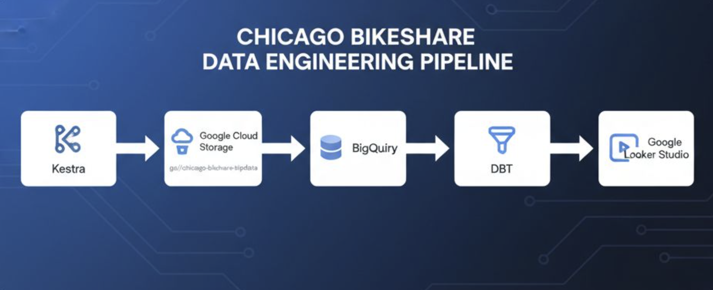
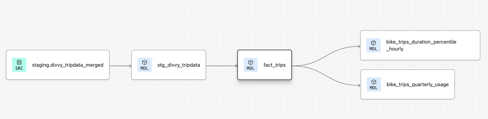

# Chicago Bikeshare (Divvy) Data Pipeline

This project is a end-to-end data engineering and analytics project for the **Chicago bikeshare program (Divvy)**, covering trip data from 2023 to 2024. The project demonstrates my skills in workflow orchestration, cloud data engineering, data transformation, and BI reporting.

## Project Overview and Technologies Used

The goal of this project is to ingest, process, transform, and analyze monthly Divvy trip data CSV files using modern cloud technologies and tools:

- **Data Source:** Monthly CSV files (each row = one bike trip record) from the official Data published by the Chicago Department of Transportation. ([Public S3 Bucket Link Here](https://divvybikes.com/system-data))
- **Kestra - Workflow Orchestration:** Dockerized [Kestra](https://kestra.io/) YAML pipeline automates data ingestion and loading, schema enforcement, and does some simple cleaning.
- **GCS Bucket - Data Lake:** Raw CSV files are stored in a Google Cloud Storage (GCS) bucket: [`gs://chicago-bikeshare-tripdata`](https://console.cloud.google.com/storage/browser/chicago-bikeshare-tripdata).
- **Big Query - Data Warehouse:** Big Query used for data storage, staging, transformation, and querying.
- **DBT - Data Modeling:** Data Build Tool (DBT) used for data transformation and building analytical models.
- **Google Looker Studio - BI Reporting:** Google Looker Studio provides dashboards and visualizations on the processed data.

Pipeline Flowchart:


```mermaid
flowchart LR
  Kestra["Kestra<br/>(Workflow Orchestration)"]
  GCS["Google Cloud Storage<br/>(Raw CSV Storage)"]
  BigQuery[(BigQuery<br/>Data Warehouse)]
  DBT["dbt<br/>(Data Modeling & Transformation)"]
  Looker["Google Looker Studio<br/>(BI & Visualization)"]

  Kestra --> GCS
  GCS --> BigQuery
  BigQuery --> DBT
  DBT --> BigQuery
  BigQuery --> Google Looker Studio
```


## Detailed Architecture and Workflow

### 1. Data Orchestration with Kestra

This project uses a **dockerized Kestra** pipeline [`gcp_tripdata_scheduled.yaml`](./01_workflow_orchestration/gcp_tripdata_scheduled.yaml) to automate monthly ingestion of Chicago Divvy bikeshare data:

- **Setup:**
  - The dockerized Kestra service is managed via [`docker-compose.yml`](./01_workflow_orchestration/docker-compose.yml).
  - Postgres Database for Kestra’s metadata and orchestration engine.
  - Kestra built from a custom [`Dockerfile.kestra`](./01_workflow_orchestration/Dockerfile.kestra), which installs required utilities like unzip.

- **Configuration and Secrets:**
  - Kestra uses a key-value pair YAML [`gcp_KVpairs.yaml`](./01_workflow_orchestration/gcp_KVpairs.yaml) to store configuration details like GCP project ID, dataset, and bucket name. 
  - Service account credentials are injected securely via environment variables.

- **Data Extraction and Upload to Cloud ([`gcp_tripdata_scheduled.yaml`](./01_workflow_orchestration/gcp_tripdata_scheduled.yaml)):**
  - Fetches monthly compressed Divvy trip data CSV .zip files from the [public Divvy S3 bucket](https://divvybikes.com/system-data).
  - Extracts CSV files from the ZIP archive.
  - Uploads the raw CSV files to a designated Google Cloud Storage (GCS) bucket [`chicago-bikeshare-tripdata`](https://console.cloud.google.com/storage/browser/chicago-bikeshare-tripdata).

- **BigQuery Tables Created ([`gcp_tripdata_scheduled.yaml`](./01_workflow_orchestration/gcp_tripdata_scheduled.yaml)):**
  - **External tables:** References raw monthly CSV files in GCS (querying data without loading it fully into BigQuery storage).
  - **Staging tables:** Each staging table feads from its corresponding month's external table, cleans data, formats nulls, and adds a `filename` column to track source month for each row.
  - **Main (merged) table:** Contains consolidated data from all months; partitioned table by Date.
- **Merge into Main Table:** Performs a merge operation into main table using each month's staging table to insert only new trip records (identified by `ride_id` column) to avoid duplicates.


- **Scheduling:** 
  - The pipeline is triggered monthly using Kestra’s built-in cron scheduler defined in [`gcp_tripdata_scheduled.yaml`](./01_workflow_orchestration/gcp_tripdata_scheduled.yaml).
    ```yaml
    triggers:
    - id: pipeline_scheduled
        type: io.kestra.plugin.core.trigger.Schedule
        cron: "0 9 15 * *"  # Runs at 9:00 AM on the 15th of every month
    ```
  - Alternatively, the backfill function in kestra can also be used to run data from previous months (which this project did)


---

### 2. Data Modeling with DBT

The following Models are created in DBT (Data Build Tool) as the transformation step for further downsteam analysis:

Staging Models:

- **Staging Model ([`stg_divvy_tripdata.sql`](./02_dbt_transformation/chicago_bikeshare/models/staging/stg_divvy_tripdata.sql)):**  
  - Enforces consistent data types and formats, selecting from the merged main table in Big Query.  
  - Includes a test run limit for development that reduces data queried.

Core Models:

- **Fact Model ([`fact_trips.sql`](./02_dbt_transformation/chicago_bikeshare/models/core/fact_trips.sql)):**  
  Builds the primary table for analysis. Adds columns such as:
  - Timestamp extracted items (year, quarter, month, day of week, hour, week of year)
  - Trip duration in seconds/minutes
  - Weekend (Boolean)
  - Trip duration category (short, medium, long)

- **Quarterly Usage Model ([`bike_trips_quarterly_usage.sql`](./02_dbt_transformation/chicago_bikeshare/models/core/bike_trips_quarterly_usage.sql)):**  
  Calculates year-over-year percentage growth of bike trips per quarter by user type (member vs casual) for 2023-2024.

- **Hourly Duration Percentiles Model ([`bike_trips_duration_percentile_hourly.sql`](./02_dbt_transformation/chicago_bikeshare/models/core/bike_trips_duration_percentile_hourly.sql)):**  
  Computes hourly distribution of trip duration percentiles (10th, median, 90th) in minutes, segmented by user type.

Lineage of the DBT models:


- **Integration with BigQuery and Automation:**  
  All dbt models build on top of the data ingested into BigQuery by the Kestra pipeline. Using **dbt Cloud Studio**, these models are deployed and run directly against the BigQuery warehouse.  
  - Jobs are scheduled within dbt Cloud to run automatically every month, shortly after Kestra completes the data ingestion.  


---

### 3. Analytics and Visualization

- The transformed data models are deployed into BigQuery.
- Google Looker Studio connects to BigQuery for dashboards and reports.
- Interactive visualizations provide insights into trip patterns, durations, rider types, and temporal trends.

---

## Example dbt Models

### Staging model ([`stg_divvy_tripdata.sql`](./02_dbt_transformation/chicago_bikeshare/models/staging/stg_divvy_tripdata.sql))

```sql
{{
    config(
        materialized='view',
        description='Staging Table for enforcing data types'
    )
}}

with
source as (
   select * from {{ source('staging', 'divvy_tripdata_merged') }}
),
renamed as (
    select
        CAST(filename AS STRING) AS filename,
        CAST(ride_id AS BYTES) AS ride_id,
        CAST(rideable_type AS STRING) AS rideable_type,
        CAST(started_at AS TIMESTAMP) AS start_datetime,
        CAST(ended_at AS TIMESTAMP) AS end_datetime,
        CAST(start_station_name AS STRING) AS start_station_name,
        CAST(start_station_id AS STRING) AS start_station_id,
        CAST(end_station_name AS STRING) AS end_station_name,
        CAST(end_station_id AS STRING) AS end_station_id,
        CAST(start_lat AS FLOAT64) AS start_lat,
        CAST(start_lng AS FLOAT64) AS start_lng,
        CAST(end_lat AS FLOAT64) AS end_lat,
        CAST(end_lng AS FLOAT64) AS end_lng,
        CAST(member_casual AS STRING) AS member_casual
    from source
)
select * from renamed


  limit 100

```

### Fact Model (`fact_trips.sql`)

```sql
{{
    config(
        materialized='table',
        description='Main trip data table'
    )
}}

with divvy_tripdata as (
    select * from {{ ref('stg_divvy_tripdata') }}
)
select
  ride_id,
  rideable_type,
  start_datetime,
  end_datetime,
  start_station_name,
  start_station_id,
  end_station_name,
  end_station_id,
  start_lat,
  start_lng,
  end_lat,
  end_lng,
  member_casual,
  DATE(start_datetime) AS start_date,
  EXTRACT(YEAR FROM start_datetime) as start_year,
  EXTRACT(QUARTER FROM start_datetime) as start_quarter,
  EXTRACT(MONTH FROM start_datetime) as start_month,
  FORMAT_TIMESTAMP('%A', start_datetime) AS start_day_of_week_name,
  EXTRACT(HOUR FROM start_datetime) as start_hour,
  EXTRACT(WEEK FROM start_datetime) as start_week_of_year,
  TIMESTAMP_DIFF(end_datetime, start_datetime, SECOND) as trip_duration_seconds,
  CASE 
    WHEN EXTRACT(DAYOFWEEK FROM start_datetime) IN (1,7) THEN TRUE 
    ELSE FALSE 
  END as is_weekend,
  CASE
    WHEN TIMESTAMP_DIFF(end_datetime, start_datetime, SECOND) < 300 THEN 'short'
    WHEN TIMESTAMP_DIFF(end_datetime, start_datetime, SECOND) BETWEEN 300 AND 1800 THEN 'medium'
    ELSE 'long'
  END as trip_duration_category
FROM divvy_tripdata
```

---

## How to Use This Repository

1. **Run Kestra pipeline** (dockerized) to ingest monthly raw data and load into BigQuery.
2. **Deploy dbt project** to build staging and fact models.
3. **Connect Google Looker Studio** to BigQuery datasets for analysis and dashboards.
4. Explore trip data trends, rider behavior, and temporal patterns.


## Contact

For questions or collaboration, please reach out:

- GitHub: [your-github-username](https://github.com/your-github-username)  
- Email: your.email@example.com

---

*This project is part of my data engineering portfolio showcasing cloud ETL pipelines, data modeling, and analytics best practices.*