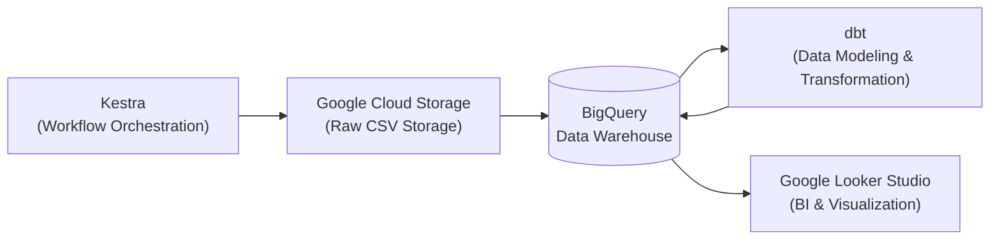
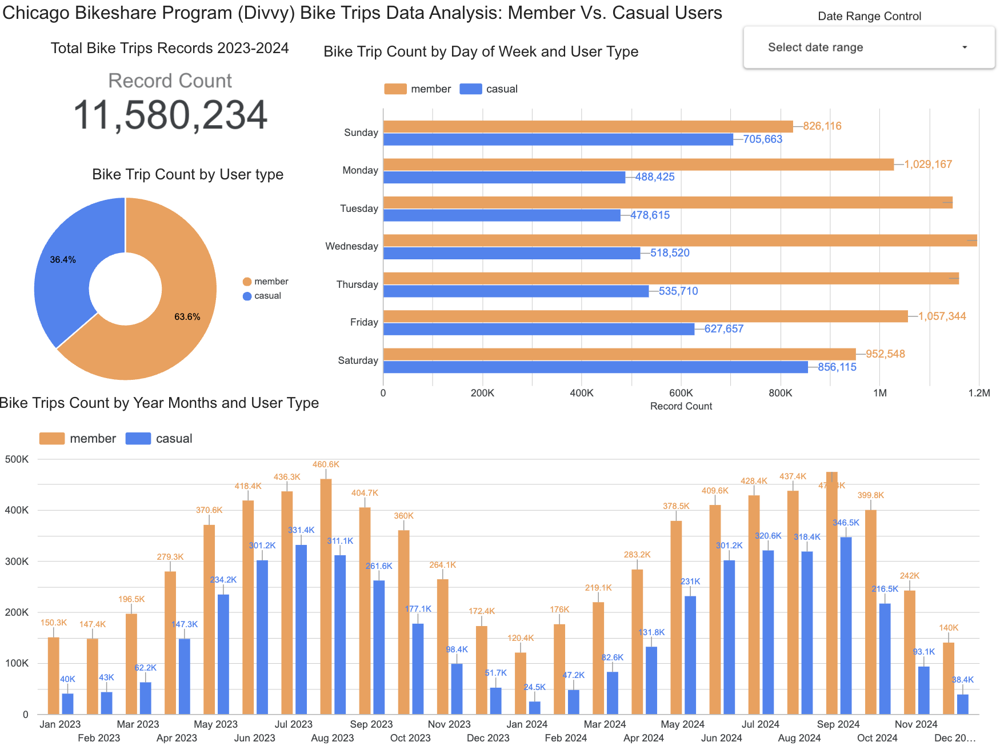
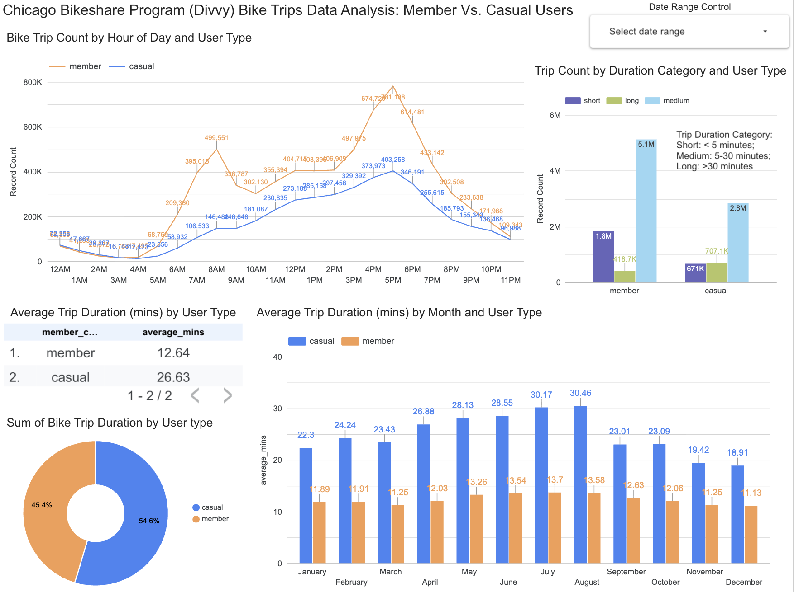
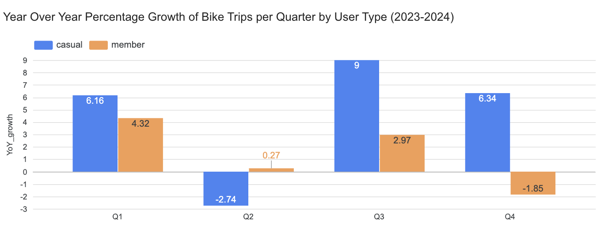
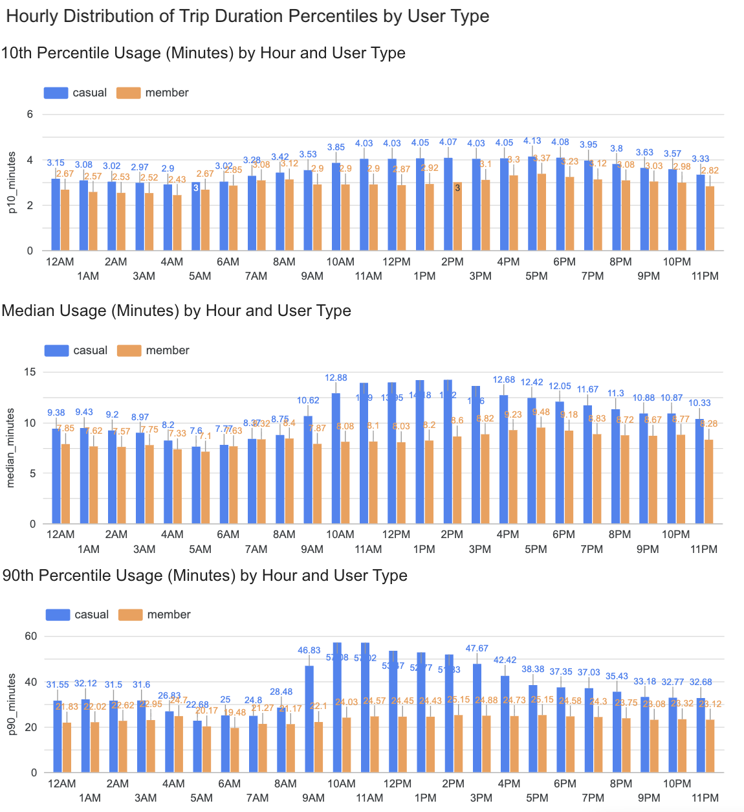

# Chicago Bikeshare (Divvy) Data Pipeline

This project is a end-to-end data engineering and analytics project for the **Chicago bikeshare program (Divvy)**, covering over 11 million records of trip data from 2023 to 2024. The project demonstrates my skills in workflow orchestration and automation, cloud data engineering, data transformation, and BI reporting.

## Project Overview and Technologies Used

This project ingests, processes, transforms, and analyzes monthly Divvy trip data CSV files using modern cloud technologies and tools to achieve automation:

- **Kestra:** [YAML based workflow orchestration pipeline](https://kestra.io/) that automates data ingestion and loading, schema enforcement, and some simple cleaning.
- **Docker:** for the containerization of the Kestra pipeline.
- **Google Cloud Storage:** Raw CSV files stored in a Google Cloud Storage (GCS) bucket serving as a data lake: [`gs://chicago-bikeshare-tripdata`](https://console.cloud.google.com/storage/browser/chicago-bikeshare-tripdata).
- **Big Query:** Big Query as a data warehouse used for structured data storage, staging, and querying: [`modern-saga-472915-f1.divvy_tripdata`](https://console.cloud.google.com/bigquery?ws=!1m4!1m3!3m2!1smodern-saga-472915-f1!2sdivvy_tripdata).
- **DBT:** Data Build Tool (DBT) used for data transformation and building analytical models.
- **Google Looker Studio:** Google Looker Studio provides dashboards and visualizations on the processed data.

### Pipeline Flowchart:



## Quick Look at the Raw Data:
Publicly available historical trip data from the Chicago Divvy Bikeshare program ([Public S3 Bucket Link Here](https://divvy-tripdata.s3.amazonaws.com/index.html)) published by the [Chicago Department of Transportation](https://divvybikes.com/system-data), released on a **monthly schedule**. 
- Each month’s data is provided in the form of CSVs compressed as .zip files named in the format: `YYYYMM-divvy-tripdata.zip`
    - for example, `202301-divvy-tripdata.zip` for January 2023.
- Depending on the month, the compressed .zip file size typically ranges from **5 MB to 30 MB**.
- Each row in the CSV files represents one bike trip record.

### CSV Columns

| Column Name           | Description                       |
|----------------------|---------------------------------|
| `ride_id`             | Unique identifier for each trip |
| `rideable_type`       | Type of bike used               |
| `started_at`          | Trip start timestamp            |
| `ended_at`            | Trip end timestamp              |
| `start_station_name`  | Name of the start station       |
| `start_station_id`    | ID of the start station         |
| `end_station_name`    | Name of the end station         |
| `end_station_id`      | ID of the end station           |
| `start_lat`           | Latitude of start location      |
| `start_lng`           | Longitude of start location     |
| `end_lat`             | Latitude of end location        |
| `end_lng`             | Longitude of end location       |
| `member_casual`       | User type (member or casual)   |

Note: For the column `member_casual`, `member` indicates that the user has joined a monthly/yearly subscription program for divvy, while `casual` means that the user pays-as-you-go (one-off trips where you only pay for the time you ride).


## Detailed Architecture and Workflow

### 1. Data Orchestration with Kestra

This project uses a **dockerized Kestra** pipeline [`gcp_tripdata_scheduled.yaml`](./01_workflow_orchestration/gcp_tripdata_scheduled.yaml) to automate monthly ingestion of Chicago Divvy bikeshare data:

- **Setup:**
  - The dockerized Kestra service is managed via [`docker-compose.yml`](./01_workflow_orchestration/docker-compose.yml).
  - Postgres Database for Kestra’s metadata and orchestration engine.
  - Kestra built from a custom [`Dockerfile.kestra`](./01_workflow_orchestration/Dockerfile.kestra), which installs required utilities like unzip.

- **Configuration and Secrets:**
  - Kestra uses a key-value pair YAML [`gcp_KVpairs.yaml`](./01_workflow_orchestration/gcp_KVpairs.yaml) to store configuration details like GCP project ID, dataset, and bucket name. 
  - Service account credentials are injected securely via environment variables.

- **Data Extraction and Upload to Cloud ([`gcp_tripdata_scheduled.yaml`](./01_workflow_orchestration/gcp_tripdata_scheduled.yaml)):**
  - Fetches monthly compressed Divvy trip data CSV .zip files from the [public Divvy S3 bucket](https://divvybikes.com/system-data).
  - Extracts CSV files from the ZIP archive.
  - Uploads the raw CSV files to a designated Google Cloud Storage (GCS) bucket [`chicago-bikeshare-tripdata`](https://console.cloud.google.com/storage/browser/chicago-bikeshare-tripdata).

- **BigQuery Tables Created ([`gcp_tripdata_scheduled.yaml`](./01_workflow_orchestration/gcp_tripdata_scheduled.yaml)):**
  - **External tables:** References raw monthly CSV files in GCS (querying data without loading it fully into BigQuery storage).
  - **Staging tables:** Each staging table feads from its corresponding month's external table, cleans data, formats nulls, and adds a `filename` column to track source month for each row.
  - **Main (merged) table:** Contains consolidated data from all months; partitioned table by Date.
- **Merge into Main Table:** Performs a merge operation into main table using each month's staging table to insert only new trip records (identified by `ride_id` column) to avoid duplicates.


- **Scheduling:** 
  - The pipeline is triggered monthly using Kestra’s built-in cron scheduler defined in [`gcp_tripdata_scheduled.yaml`](./01_workflow_orchestration/gcp_tripdata_scheduled.yaml).
    ```yaml
    triggers:
    - id: pipeline_scheduled
        type: io.kestra.plugin.core.trigger.Schedule
        cron: "0 9 15 * *"  # Runs at 9:00 AM on the 15th of every month
    ```
  - Alternatively, the backfill function in kestra can also be used to run data from previous months (which this project did)


---

### 2. Data Modeling with DBT

**Integration with BigQuery and Automation:**  
  - The dbt models utilize the data ingested into BigQuery by the Kestra pipeline. 
  - Using **dbt Cloud Studio**, models within dbt Cloud are scheduled to run automatically every month to incorporate new data, shortly after Kestra completes the data ingestion.

The following Models are created in DBT (Data Build Tool) as the transformation step for further downsteam analysis:

Staging Models:

- **Staging Model ([`stg_divvy_tripdata.sql`](./02_dbt_transformation/chicago_bikeshare/models/staging/stg_divvy_tripdata.sql)):**  
  - Enforces consistent data types and formats, selecting from the merged main table in Big Query.  
  - Includes a test run limit for development that reduces data queried.

Core Models:

- **Fact Model ([`fact_trips.sql`](./02_dbt_transformation/chicago_bikeshare/models/core/fact_trips.sql)):**  
  Builds the primary table for analysis. Adds columns such as:
  - Timestamp extracted items (year, quarter, month, day of week, hour, week of year)
  - Trip duration in seconds/minutes
  - Weekend (Boolean)
  - Trip duration category (short, medium, long)

- **Quarterly Usage Growth Model ([`bike_trips_quarterly_usage.sql`](./02_dbt_transformation/chicago_bikeshare/models/core/bike_trips_quarterly_usage.sql)):**  
  Calculates year-over-year percentage growth of bike trips per quarter by user type (member vs casual) for 2023-2024.

- **Hourly Duration Percentiles Model ([`bike_trips_duration_percentile_hourly.sql`](./02_dbt_transformation/chicago_bikeshare/models/core/bike_trips_duration_percentile_hourly.sql)):**  
  Computes hourly distribution of trip duration percentiles (10th, median, 90th) in minutes, segmented by user type.

Lineage of the DBT models:


---

### 3. Analytics and Visualization: Google Looker Studio

- Data models transformed in DBT are deployed back into BigQuery as tables.
- Google Looker Studio connects to BigQuery to those tables as a data source for the following report.
- The Dashboard could be accessed here: **[`chicago_bikeshare_report_2023_2024`](https://lookerstudio.google.com/reporting/b38cc423-b4e1-4f73-b794-7f03c64d210b)**

#### Report Screenshots:




Key Findings:
- **Trip Count/Duration Insights based on User Type:**
  - Of the 11,580,234 total bike trips between 2023 and 2024, 63.6% of these trips are made by members, while 36.4% are by casual users. 
  - Although members are the primary users of the bikeshare program, on average they take shorter trips (12.64 minutes) compared to casual users (26.63 minutes).
  - In result, the proportion of total usage time of casual users (54.6%) exceed that of member users (45.4%).
  - Casual users likely use the bikes with longer trips for leisure, while members, who have joined a subscription plan, prefer shorter, more frequent trips, possibly for commuting.
  - This can be further confirmed by the fact that Casual Users' usage peak on weekends, while Members' usage peak on Weekdays.

- **Seasonality of Bike Usage:**
  - Usage spikes in summer months (June-September), aligning with warmer weather. On the other hand, bike usage drops significantly during the colder months, such as December and January.
  - This reflects the seasonal nature of bikeshare usage, with casual users being more active in the warmer months (longer ride times).

- **Hourly Trip Patterns:**
  - Casual Users: Peak usage occurs in the evening, between 6 PM and 8 PM, reflecting more recreational or after-work trips.
  - Members: Peak usage is observed in both morning and evening rush hour (7-9AM and 4-6PM), suggesting regular commuting patterns.

**Quarterly Usage Model ([`bike_trips_quarterly_usage.sql`](./02_dbt_transformation/chicago_bikeshare/models/core/bike_trips_quarterly_usage.sql)):** 

  - Compared to 2023, Casual Users usage experienced growth in Q1,3,4 of 2024, while Member usage experienced growth in Q1,2,3.

**Hourly Duration Percentiles Model ([`bike_trips_duration_percentile_hourly.sql`](./02_dbt_transformation/chicago_bikeshare/models/core/bike_trips_duration_percentile_hourly.sql)):**  

  - Across all 10th, median, and 90th percentiles, Casual Members had longer ride times across all hours, and showed a more variable ride time across the day.

---

## Example dbt Models

### Staging model ([`stg_divvy_tripdata.sql`](./02_dbt_transformation/chicago_bikeshare/models/staging/stg_divvy_tripdata.sql))

```sql
{{
    config(
        materialized='view',
        description='Staging Table for enforcing data types'
    )
}}

with
source as (
   select * from {{ source('staging', 'divvy_tripdata_merged') }}
),
renamed as (
    select
        CAST(filename AS STRING) AS filename,
        CAST(ride_id AS BYTES) AS ride_id,
        CAST(rideable_type AS STRING) AS rideable_type,
        CAST(started_at AS TIMESTAMP) AS start_datetime,
        CAST(ended_at AS TIMESTAMP) AS end_datetime,
        CAST(start_station_name AS STRING) AS start_station_name,
        CAST(start_station_id AS STRING) AS start_station_id,
        CAST(end_station_name AS STRING) AS end_station_name,
        CAST(end_station_id AS STRING) AS end_station_id,
        CAST(start_lat AS FLOAT64) AS start_lat,
        CAST(start_lng AS FLOAT64) AS start_lng,
        CAST(end_lat AS FLOAT64) AS end_lat,
        CAST(end_lng AS FLOAT64) AS end_lng,
        CAST(member_casual AS STRING) AS member_casual
    from source
)
select * from renamed


  limit 100

```

### Fact Model (`fact_trips.sql`)

```sql
{{
    config(
        materialized='table',
        description='Main trip data table'
    )
}}

with divvy_tripdata as (
    select * from {{ ref('stg_divvy_tripdata') }}
)
select
  ride_id,
  rideable_type,
  start_datetime,
  end_datetime,
  start_station_name,
  start_station_id,
  end_station_name,
  end_station_id,
  start_lat,
  start_lng,
  end_lat,
  end_lng,
  member_casual,
  DATE(start_datetime) AS start_date,
  EXTRACT(YEAR FROM start_datetime) as start_year,
  EXTRACT(QUARTER FROM start_datetime) as start_quarter,
  EXTRACT(MONTH FROM start_datetime) as start_month,
  FORMAT_TIMESTAMP('%A', start_datetime) AS start_day_of_week_name,
  EXTRACT(HOUR FROM start_datetime) as start_hour,
  EXTRACT(WEEK FROM start_datetime) as start_week_of_year,
  TIMESTAMP_DIFF(end_datetime, start_datetime, SECOND) as trip_duration_seconds,
  CASE 
    WHEN EXTRACT(DAYOFWEEK FROM start_datetime) IN (1,7) THEN TRUE 
    ELSE FALSE 
  END as is_weekend,
  CASE
    WHEN TIMESTAMP_DIFF(end_datetime, start_datetime, SECOND) < 300 THEN 'short'
    WHEN TIMESTAMP_DIFF(end_datetime, start_datetime, SECOND) BETWEEN 300 AND 1800 THEN 'medium'
    ELSE 'long'
  END as trip_duration_category
FROM divvy_tripdata
```